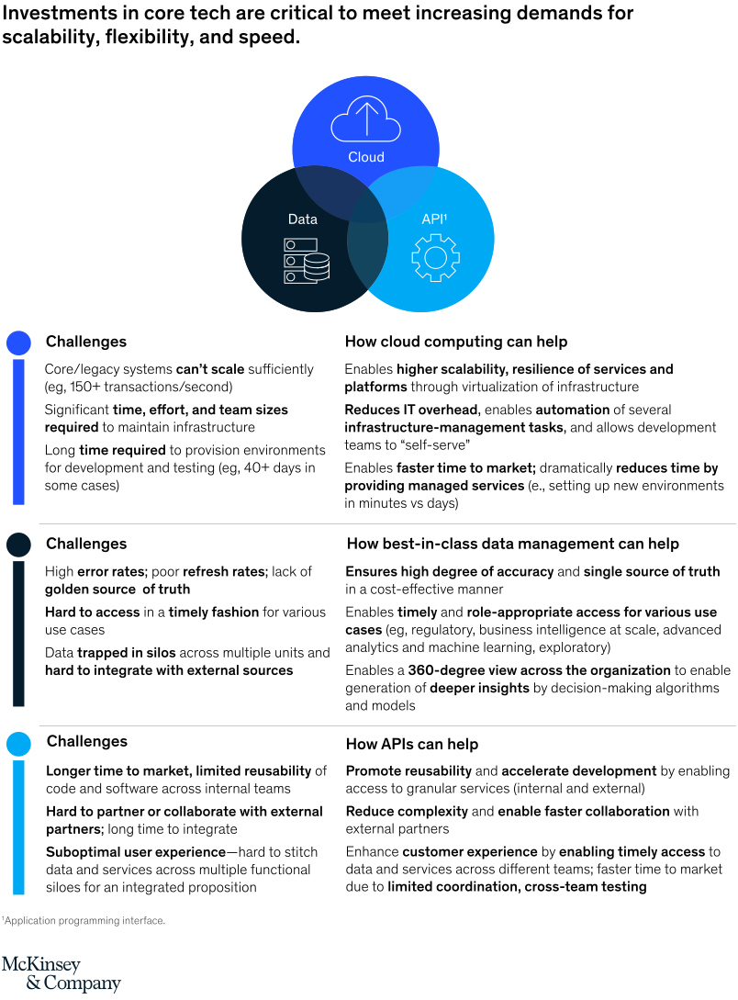
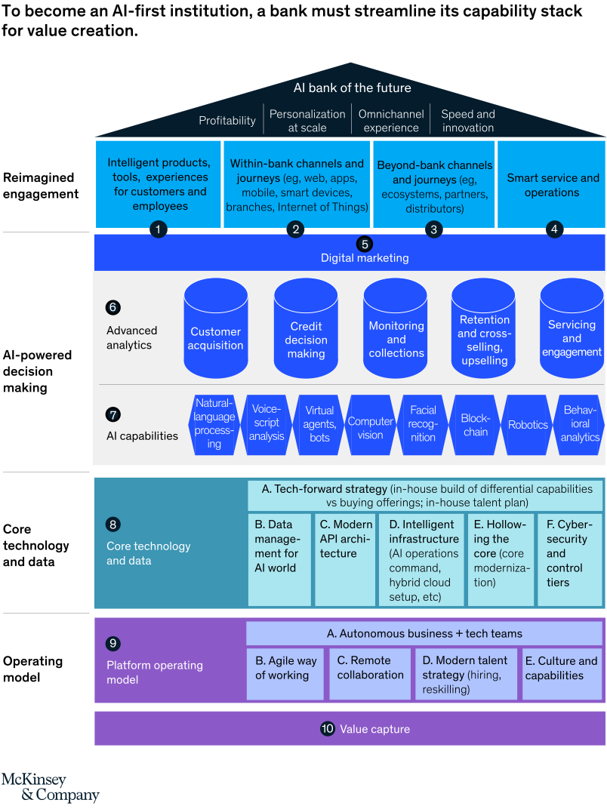

# AI bank of the future: Can banks meet the AI challenge

> https://www.mckinsey.com/industries/financial-services/our-insights/ai-bank-of-the-future-can-banks-meet-the-ai-challenge

> Artificial intelligence technologies are increasingly integral to world we live in, and banks need to deploy these technologies at scale to remain relevant. Success requires a holistic transformation spanning multiple layers of the organization.

许多银行缺少清晰的AI策略、不便捷和缺乏投入的技术核心、支离破碎额数据资产、妨碍业务和技术团队协作的过时运营模型，影响了他们的全组织内推广AI策略。

- Why must banks become AI-first?
- What might the AI-bank of the future look like?
- What obstacles prevent banks from deploying AI capabilities at scale?
- How can banks transform to become AI-first?

## Why

银行技术的发展：

- 1960s: ATMs
- 1970s: electronic & card payment
- 2000s: 24/7 online banking
- 2010s: mobile "banking on-the-go"

按照McKinsey的[管理者AI手册 The Executive's AI Playbook](https://www.mckinsey.com/business-functions/mckinsey-analytics/our-insights/the-executives-ai-playbook?page=industries/banking/)的内容，银行业的AI整体的产值可以达到1万亿美元。主要是用于**加速营收**、通过自动化和降低错误率以及提升资源利用率来**降低损耗**、通过处理和洞察大量的数据资产来**发现新的和未预见的商业机会**。

AI战略可以提升银行的四项关键结果：

- 更高的利润
- 更全面的个性化选项
- 独特的全渠道体验
- 快速的创新循环

错失AI战略的公司面临被对手替代或者被客户抛弃的风险，当前的一些趋势会加速这种风险：

### 1. 银行数字化提升带来的客户期待持续提升提升

### 2. 头部金融组织对持续对高级AI技术的使用和投入

- **RPA**（Robot Process Automation）（36%）投入于结构化的运营任务
- **虚拟助理**和**对话式界面**（32%）投入于客户服务业务
- **机器学习**投入于金融诈骗分析

### 3. 数字化生态不断淘汰传统金融服务

比如微信：

- 订车、订餐、订相关服务
- 玩游戏
- 转账
- 个人信用

### 4. 科技巨头开始进入金融业，与其核心业务平行发展

## What might it look like

对外，AI-first bank应该提供的是

- **intelligent 智能**：行动建议、预见和自动进行关键决策和任务
- **personalized 个性化**：提供适时和相关的、依据客户过去行为和情境的服务
- **omnichannel 全渠道**：无缝地提供跨线下和线上多设备一致性的体验
- **beyond banking 超越银行**：提供全方位的理财服务和周边日常服务的集成

对内，需要极致地自动化手动任务来提供运营效率的优化，以及提供高级的诊断引擎来替代人类决策。

## What obstacles

## How

- 第一层：重新构思客户沟通层
- 第二层：构建AI支撑的决策制定层
- 第三层：增强核心技术和数据基础架构
- 第四层：转变成平台运营模型

### 核心技术和数据层

